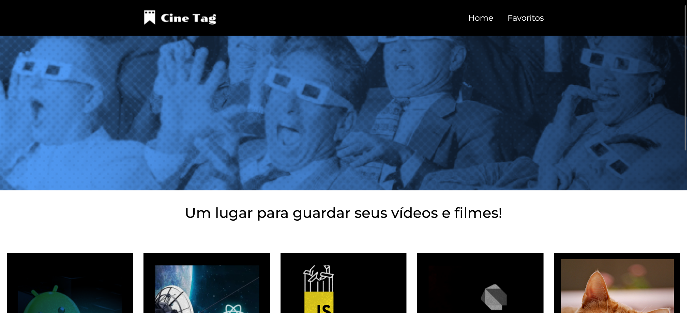

# Cinetag

Este é um projeto em React desenvolvido no curso *React: praticando React com Js* da [Alura](https://cursos.alura.com.br/).

## Tecnologias utilizadas

- React (Vite)
- React Router DOM
- FontAwesome Icons

## Conceitos abordados

- Rotas
- Contextos
- Hooks personalizados
- Requisições

## Como acessar online

O deploy do projeto foi feito pela [Vercel](https://vercel.com/) e está disponível em https://cinetag-renansantos7.vercel.app/

## Como rodar localmente

Este projeto foi criado usando [Vite](https://vite.dev), portanto você pode seguir a documentação desse script para fazer deploy do site localmente.

No caso, primeiro você precisará baixar o projeto com executando o seguinte comando no terminal:

```
git clone https://github.com/RenanSantos7/ola-mundo-react-router.git
```

Agora, instale as dependências:

```
npm i
```

E por fim rode o projeto com:

```
npm run dev
```

O terminal mostrará o endereço para acessar o site no qual você pode clicar para abri-lo. Você também pode apertar `o` e depois `Enter` para fazer isso.
